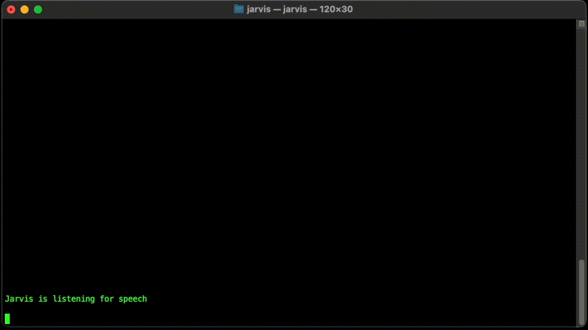

# Jarvis
#### An AI powered home automation assistant in Rust

Jarvis is an Iron Man inspired pet project that provides a basic home automation assistant with customizable commands. It runs completely locally and doesn't need an internet connection. It knows how to turn various things (lights, appliances, ...) on or of, it can raise or lower window blinds, temperature and all sorts of other things. It is extensible and can accomodate any sort of command. It includes a quirky question answering capability powered by GPT2 that is more hilarious than useful.

_I developed Jarvis solely out of interest in AI and Rust and learning more about both. It is a proof of concept automation assistant that isn't reliable but is very extensible and could easily be made improved._



## Learning about Jarvis

I made an entire blog post series on how I implemented it and what I learned by doing it. It's meant to be a teaching project for other people that might be interested in a similar project. It can be found on my [janhalozan.com](https://janhalozan.com) website. The series starts with the intro post at: [https://janhalozan.com/2024/07/07/home-assistant-intro/](https://janhalozan.com/2024/07/07/home-assistant-intro/).

## Installation

Jarvis runs completely locally but does require a few things to be installed on the system in order to run. I'd recommend checking out the blog post for details on how to install particular things.

To run Jarvis it needs:
- A compatible `pytorch` version for the `tch` crate. I'm using `2.2.0`.
- Correctly set `.cargo/config.toml` variables for `LIBTORCH` and `LD_LIBRARY_PATH`
- Installed `tts` on the system. It can use a different speech synthesizer by tweaking `src/processing/speech_synthesizer.rs`


## Directory structure
```
|- models/              (WhisperAI models for speech recognition)
|- config/              (Supported command map and other configuration options)
|- src
    |- core/            (Shared functionality code and reusable components.)
    |- processing/      (Main processing pipeline for jarvis functionality)
    |- model/           (Model files)
    |- errors/          (Jarvis error handling)
    |- traits/          (Shared trait definitions)
```

## Supported commands

To define commans that jarvis can run there's an example `command_map.yaml` present in `config`. It has the following structure:
```yaml
commands:
    - "<LOCATION>":
        - <ACTION>:
            - <SUBJECT>
            - ...
            - <SUBJECT>
        - <ACTION>:
            - <SUBJECT>
            - ...
        - more actions...
    - more locations...
```

A concrete example
```yaml
commands:
  - "living room":
    - switch:
      - light
    - gradient:
      - windowblinds
      - temperature
  - "dining room":
    - switch:
      - light
```

Locations are recognized automatically and can be arbitrary strings.  

Actions are used to define what operation can be performed. Currently supported actions are:
- `switch` used for toggling the subject on or off. 
- `gradient` used for a continuous variable that can be raised or lowered. Also supports turning all the way up or down eg. "Shut the window blinds".  
To define additional actions `src/model/command_action.rs` should be modified.

Subjects are things that actions can be performed upon. Currently supported are: `light`, `teapot`, `window blinds`, `temperature`, `ventilator`. They are easy to add and can be added in `src/model/command_subject.rs`

## Running Jarvis

To run you can use `cargo run` or `cargo run --release` for the optimized version.
Jarvis is a multithreaded app and shutting it down may have a short delay while all auxiliary threads wind down. Depending on the models you're using it can take up a significant amount of memory to run (around 1GB).

### Setting up on a Raspberry Pi 5

_Note that these are mostly internal notes so that I could get the thing running on a Raspberry Pi 5. And they're mostly here for my future reference but if they're useful to you feel free to make sense of them._

Env variables:

```shell
# Make sure the following env variables are set:
export LIBTORCH_USE_PYTORCH=1
export LIBTORCH_BYPASS_VERSION_CHECK=1
export LD_LIBRARY_PATH=/home/jarvis/.virtualenvs/torch/lib/python3.11/site-packages/torch/lib:/home/jarvis/.virtualenvs/torch/lib/python3.11/site-packages/torch.libs:/lib/aarch64-linux-gnu
```

Installation (might be incomplete):

```shell
sudo apt-get update
curl --proto '=https' --tlsv1.2 -sSf https://sh.rustup.rs | sh # Install rust
sudo apt install -y libssl-dev pkg-config
sudo apt install -y libasound2-dev
sudo apt install -y libclang
sudo apt install -y libclang-dev clang
sudo apt install -y cmake

sudo apt install -y python3-virtualenv
sudo apt install -y python3-virtualenvwrapper
echo "export WORKON_HOME=$HOME/.virtualenvs" >> ~/.bashrc
echo "source /usr/share/virtualenvwrapper/virtualenvwrapper.sh" >> ~/.bashrc
source ~/.bashrc
mkvirtualenv torch

workon torch
pip3 install setuptools numpy Cython
pip3 install requests
pip3 install torch==2.4.1 torchvision==0.19.1 --index-url https://download.pytorch.org/whl/cpu
```

Running:

```shell
# Ensure you've set the env variables

# Activate the venv for python
workon torch

cargo run
```

### Whisper models

Additional language recognition models can be downloaded from [https://ggml.ggerganov.com/](https://ggml.ggerganov.com/). I recommend placing them in `models` and you can also tweak the `default_model_path` in `speech_recognizer.rs`.

## License

Copyright (c) Jan Halozan

Permission is hereby granted, free of charge, to any person obtaining
a copy of this software and associated documentation files (the
"Software"), to deal in the Software without restriction, including
without limitation the rights to use, copy, modify, merge, publish,
distribute, sublicense, and/or sell copies of the Software, and to
permit persons to whom the Software is furnished to do so, subject to
the following conditions:

The above copyright notice and this permission notice shall be
included in all copies or substantial portions of the Software.

THE SOFTWARE IS PROVIDED "AS IS", WITHOUT WARRANTY OF ANY KIND,
EXPRESS OR IMPLIED, INCLUDING BUT NOT LIMITED TO THE WARRANTIES OF
MERCHANTABILITY, FITNESS FOR A PARTICULAR PURPOSE AND
NONINFRINGEMENT. IN NO EVENT SHALL THE AUTHORS OR COPYRIGHT HOLDERS BE
LIABLE FOR ANY CLAIM, DAMAGES OR OTHER LIABILITY, WHETHER IN AN ACTION
OF CONTRACT, TORT OR OTHERWISE, ARISING FROM, OUT OF OR IN CONNECTION
WITH THE SOFTWARE OR THE USE OR OTHER DEALINGS IN THE SOFTWARE.

### Acknowledgements

This project uses the following open-source libraries:

- [rust-bert](https://github.com/guillaume-be/rust-bert) by Guillaume Bertaud, licensed under the Apache License 2.0.
